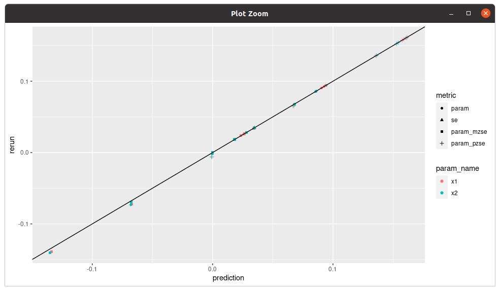
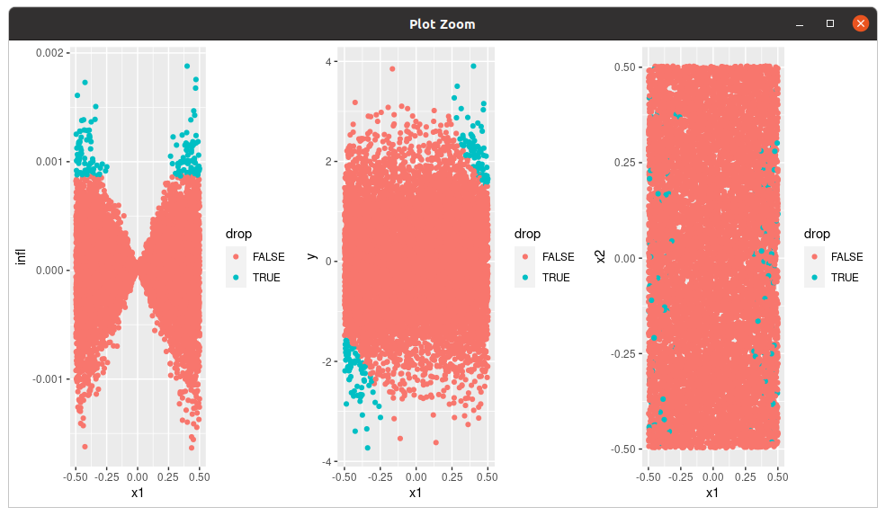

# ZAM influence

This repo contains code to perform analyses described in our paper, "Automatic
Finite-Sample Robustness Metrics," for the case of ordinary least squares and
instrumental variable regressions. The repo name comes from "Z-estimator
approximate maximal influence".

**Warning:**  The latest PR made big changes to the API and code organization,
and is not backwards compatible.  To use the old version, install as below
using `ref="v0.2"` instead of `ref=master`.

# Installation

1. You can install the R library directly from github.
```
> library(devtools)
> devtools::install_github("https://github.com/rgiordan/zaminfluence/",
                           ref="master",
                           subdir="zaminfluence",
                           force=TRUE)
```

You can install different branches using the `ref` argument.

2. Done, hopefully!  You should now be able to run the script in
   `examples/simple_examples.R`.

Please submit an issue or email us if you have any questions or comments!

# Simple Example

The following simple example finds and plots influential
sets for a linear regression problem.  It is taken from
`examples/simple_examples.R`.

```
library(tidyverse)
library(GridExtra)
library(zaminfluence)

#############################
# Generate data.
set.seed(42)
x_dim <- 3
param_true <- 0.1 * runif(x_dim)
df <- GenerateRegressionData(num_obs, param_true, num_groups=NULL)

#############################
# Fit a regression model.
x_names <- sprintf("x%d", 1:x_dim)
reg_form <- formula(sprintf("y ~ %s - 1", paste(x_names, collapse=" + ")))
fit_object <- lm(data = df, formula=reg_form, x=TRUE, y=TRUE)

#############################
# Now it's zaminfluence time!

# Get influence scores for the first two regressors.
model_grads <-
    ComputeModelInfluence(fit_object) %>%
    AppendTargetRegressorInfluence("x1") %>%
    AppendTargetRegressorInfluence("x2")

# Compute the changes needed to change sign, significance, and both
signals <- GetInferenceSignals(model_grads)

# Predict the changes, re-run the model at the left-out points, and
# compare the two.

preds <- PredictForSignals(signals, model_grads)
reruns <- RerunForSignals(signals, model_grads)
reruns_df <- GetSignalsAndRerunsDataframe(signals, reruns, model_grads)
preds_df <- GetSignalsAndRerunsDataframe(signals, preds, model_grads)

summary_df <-
    rbind(reruns_df %>% mutate(method="rerun"),
          preds_df %>% mutate(method="prediction")) %>%
    pivot_wider(-method, names_from=method, values_from=value)

ggplot(summary_df) +
    geom_point(aes(x=prediction, y=rerun, color=param_name, shape=metric)) +
    geom_abline(aes(slope=1, intercept=0))

##############################################################
# Visualize which points are being dropped to change both
# sign and significance of the x1 regressor

signal <- signals[["x1"]][["both"]]
df$drop <- GetWeightVector(signal$apip$inds, nrow(df), bool=TRUE, invert=TRUE)
df$infl <- signal$qoi$infl

grid.arrange(
    ggplot(df) +
        geom_point(aes(x=x1, y=infl, color=drop)),
    ggplot(df) +
        geom_point(aes(x=x1, y=y, color=drop)),
    ggplot(df) +
        geom_point(aes(x=x1, y=x2, color=drop)),
    ncol=3
)
```



